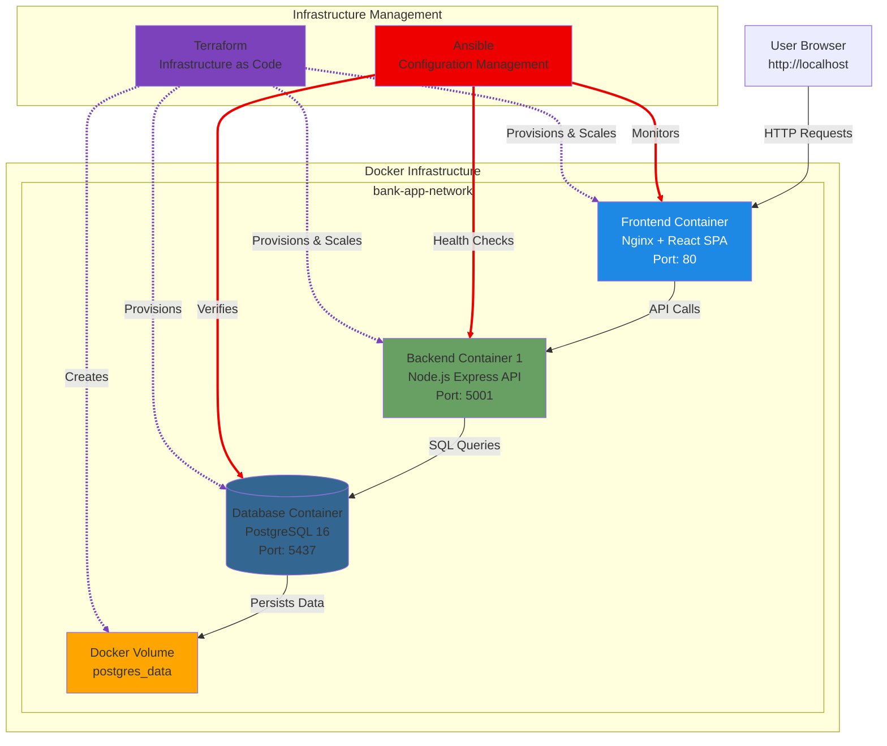

# Lab-0: Introduction to Secure Development with IBM Bob

## Welcome to Track D: Secure Development with IBM Bob

Welcome to the IBM Bob Developer Day Ottawa! In this track, you'll learn how to accelerate Authority to Operate (ATO) readiness and security assessment preparation using IBM Bob as your AI-powered security assessment assistant.

---

## Lab Objectives

By the end of this lab, you will:
- ✅ Understand the banking application architecture
- ✅ Learn about ITSG-33 security controls and their importance
- ✅ Understand the principles of secure development
- ✅ Learn how Bob's custom modes work
- ✅ Set up your environment for the hands-on labs
- ✅ Verify that the ITSG-33 Security Assessor mode is available

**Estimated Time:** 15-20 minutes

---

## Part 1: Lab Setup and Verification

### Step 1: Access the Lab Environment

1. **Open the Lab Environment:**
   
   Click on this link to access the lab environment:
   
   **Link:** https://vdi.cloud.techzone.ibm.com/guacamole

2. **Navigate to Your Environment:**
   
   - Click on the **+** sign next to **IBM Cloud**
   - Click on the **+** sign next to **Environment 6a3567090ebee3953d22b53c: #<ab>-BobDevDay-Track-E**
   - Then click on **VNC Desktop**

3. **Open Activities:**
   
   Click on **"Activities"** in the top left corner and look for Bob. Open IBM Bob.
   
   > 💡 **Note:** There might be a pop-up asking you to "Choose password for new keyring". Click on **"Cancel"**.

4. **Open the Sample Application:**
   
   - Press **Ctrl+Shift+E** to open the Explorer, or click on the **"Explorer"** icon
   - Click on **"Open Folder"**
   - Select the sample application available at:
     ```
     /home/itzuser/sample_application
     ```

---

### Step 2: Sign In to Bob

Open IBM Bob and log in using your IBM ID by clicking on "Log in to Bob".

- Log in using your IBM ID credentials. If you don't have an IBM ID, create one at [IBM ID Registration](https://www.ibm.com/account/reg/register.do).
- Once you have successfully logged in, click again on "Activities" in the top left corner and look for Bob.

---

### Step 3: Verify Bob Can Access Files

Ask Bob:
```
"Can you list the files in the application/backend/src directory?"
```

**Expected Response:** Bob should list files like `server.js`, `db/`, `routes/`, `middleware/`

---

### Step 4: Verify Custom Mode is Available

**In Bob's interface, look for the mode selector and verify that you can see:**
- 🔒 ITSG-33 Security Assessor

The mode should appear in the list of available modes. If you don't see it, you may need to reload Bob or restart VS Code.

---

### Step 5: Switch to the ITSG-33 Security Assessor Mode

**Click on the mode selector and choose "🔒 ITSG-33 Security Assessor"**

Once activated, Bob will operate as a security assessor with access to the vulnerability detection patterns.

---

### Step 6: Verify the Mode is Active

Ask Bob:
```
"What is your role and what can you help me with?"
```

**Expected Response:** Bob should describe itself as an ITSG-33 Security Assessor and explain its capabilities for security assessment.

---

### Troubleshooting

#### Issue: Custom mode doesn't appear in the mode list
**Solution:**
1. Verify the file exists at `.bob/custom_modes.yaml`
2. Check the YAML syntax is correct
3. Restart VS Code or reload Bob
4. Check Bob's output panel for any error messages

#### Issue: Bob can't access project files
**Solution:** Ensure Bob is running in the correct directory (`draft_labs/`)

#### Issue: Bob doesn't use the vulnerability detection patterns
**Solution:**
1. Verify the files exist at:
   - `.bob/rules-itsg33-assessor/01-assessment-methodology.md`
   - `.bob/rules-itsg33-assessor/02-vulnerability-patterns.md`
   - `.bob/skills/itsg33-vulnerability-detection/SKILL.md`
2. Make sure you're in the ITSG-33 Security Assessor mode
3. The mode-specific rules load automatically; the skill activates when you request an assessment

---

## Part 2: Understanding the Application

### The Banking Application

You'll be working with a **realistic banking application** that includes:

#### Frontend (React)
- **Location:** `application/frontend/`
- **Technology:** React + Vite
- **Features:**
  - User registration and login
  - Account dashboard
  - Deposit and withdrawal operations
  - Loan request and management
  - Account statement viewing

#### Backend (Node.js)
- **Location:** `application/backend/`
- **Technology:** Node.js + Express + PostgreSQL
- **Features:**
  - RESTful API endpoints
  - JWT-based authentication
  - Database operations
  - Business logic for banking operations

#### Database (PostgreSQL)
- **Technology:** PostgreSQL 15
- **Purpose:** Stores user accounts, transactions, and loan data

#### Infrastructure
- **OpenShift/Kubernetes:** `infrastructure/openshift/`
  - Deployment manifests
  - Service definitions
  - Routes and networking
- **Terraform:** `infrastructure/terraform/`
  - Infrastructure as Code
  - Container orchestration
- **Ansible:** `infrastructure/ansible/`
  - Configuration management
  - Deployment automation

### Application Architecture Diagram

The application uses Docker containers orchestrated by Terraform and managed by Ansible:



**Key Components:**
- **Terraform (Purple)**: Provisions and scales the infrastructure
- **Ansible (Red)**: Performs health checks and monitoring
- **Frontend (Blue)**: Nginx serving React SPA on port 80
- **Backend (Green)**: Node.js Express API on port 5001
- **Database (Blue)**: PostgreSQL 16 on port 5437
- **Volume (Orange)**: Persistent storage for database data

### Important Note: Intentional Vulnerabilities

⚠️ **This application contains intentional security vulnerabilities for educational purposes.**

The application has been designed with **specific security vulnerabilities** that violate ITSG-33 security controls. These vulnerabilities represent common security mistakes found in real-world applications.

**DO NOT deploy this application to production!**

---

## Part 2: Understanding ITSG-33 Security Controls

### What is ITSG-33?

**ITSG-33** (Information Technology Security Guidance 33) is the Canadian government's security control framework. It's similar to NIST 800-53 used in the United States.

ITSG-33 provides a comprehensive set of security controls that federal systems must implement to achieve **Authority to Operate (ATO)**.

### Why ITSG-33 Matters

For federal government systems in Canada:
- **Mandatory Compliance:** All systems must meet ITSG-33 requirements
- **ATO Requirement:** Cannot deploy to production without ATO
- **Risk Management:** Controls reduce security risks systematically
- **Audit Trail:** Provides evidence for security assessments

### The 10 Control Families We'll Focus On

In this lab, we'll focus on **10 critical control families** that are commonly violated in application development:

#### 1. **IA-2: Identification and Authentication**
**Purpose:** Ensure users and systems are properly identified and authenticated

**Common Violations:**
- Hardcoded database credentials in source code
- Hardcoded JWT secrets for authentication

**Why It Matters:** Compromised credentials = full system access

---

#### 2. **IA-5: Authenticator Management**
**Purpose:** Properly manage authentication credentials and secrets

**Common Violations:**
- Secrets stored in deployment YAMLs
- Secrets in Terraform variables
- Secrets in Ansible playbooks

**Why It Matters:** Exposed secrets in version control or configurations = security breach

---

#### 3. **AC-6: Least Privilege**
**Purpose:** Grant only the minimum privileges necessary

**Common Violations:**
- Containers running as root user
- Privileged containers with full host access
- Docker socket mounted in containers
- No resource limits on containers

**Why It Matters:** Excessive privileges = larger attack surface and greater impact from compromise

---

#### 4. **SC-7: Boundary Protection**
**Purpose:** Monitor and control communications at system boundaries

**Common Violations:**
- Databases exposed via NodePort (publicly accessible)
- No network policies (unrestricted pod-to-pod communication)
- No TLS/SSL encryption (cleartext data transmission)
- Debug ports exposed externally

**Why It Matters:** Weak boundaries = easy lateral movement for attackers

---

#### 5. **SC-28: Protection of Information at Rest**
**Purpose:** Protect data stored on disk from unauthorized access

**Common Violations:**
- Unencrypted database storage volumes

**Why It Matters:** Physical access to storage = data breach

---

#### 6. **CP-9: Information System Backup**
**Purpose:** Ensure data can be recovered after incidents

**Common Violations:**
- Using emptyDir for database storage (data lost on pod restart)

**Why It Matters:** No persistence = guaranteed data loss

---

#### 7. **SI-2: Flaw Remediation**
**Purpose:** Identify and fix security flaws promptly

**Common Violations:**
- Outdated container base images with known vulnerabilities

**Why It Matters:** Known vulnerabilities = easy exploitation

---

#### 8. **CM-2: Baseline Configuration**
**Purpose:** Establish and maintain baseline configurations

**Common Violations:**
- No remote state backend for Terraform (local state files)

**Why It Matters:** No configuration tracking = drift and inconsistency

---

#### 9. **CA-7: Continuous Monitoring**
**Purpose:** Monitor systems continuously for security events

**Common Violations:**
- No centralized logging infrastructure
- Logging sensitive data (passwords, tokens) in application logs

**Why It Matters:** No visibility = cannot detect or respond to incidents

---

#### 10. **SA-12: Supply Chain Risk Management**
**Purpose:** Protect against supply chain compromises

**Common Violations:**
- No container image vulnerability scanning in CI/CD pipeline

**Why It Matters:** Compromised dependencies = backdoors in your application

---

## Part 4: The Challenge of Security Assessment

### Traditional Security Assessment Process

Typically, achieving ATO readiness involves:

1. **Manual Code Review** (1-2 weeks)
   - Security experts review every file
   - Look for hardcoded credentials, misconfigurations
   - Document findings in spreadsheets

2. **Infrastructure Review** (1 week)
   - Review Kubernetes manifests
   - Check Terraform configurations
   - Analyze network policies

3. **Report Generation** (3-5 days)
   - Compile findings into assessment report
   - Map to ITSG-33 controls
   - Prioritize remediation

4. **Remediation** (2-4 weeks)
   - Fix identified vulnerabilities
   - Re-test and verify fixes
   - Update documentation

**Total Time:** 4-8 weeks minimum

### The Problem

- ⏰ **Time-Consuming:** Weeks of manual review
- 👥 **Resource-Intensive:** Requires security experts
- 📋 **Error-Prone:** Easy to miss vulnerabilities
- 🔄 **Not Repeatable:** Hard to re-run consistently
- 📊 **Inconsistent:** Different reviewers find different issues

---

## Part 5: How Bob Accelerates Security Assessment

### Bob's Custom Mode System

IBM Bob can be customized with **custom modes** to become a specialized security assessor. Custom modes are defined in YAML configuration files that specify:

- **Role Definition:** What Bob's persona and expertise are
- **When to Use:** What types of tasks the mode is suited for
- **Tool Groups:** What capabilities Bob has in this mode
- **Custom Instructions:** Specific guidance for how to operate

### The ITSG-33 Security Assessor Mode

For this lab, we've created a custom mode called **"🔒 ITSG-33 Security Assessor"** that:
- Acts as a professional security assessor
- Follows a systematic assessment methodology
- Generates compliance-focused reports
- Provides actionable remediation guidance

**Location:** `.bob/custom_modes.yaml`

### The Vulnerability Detection System

We've created a comprehensive vulnerability detection system with two components:

#### 1. Mode-Specific Rules (`.bob/rules-itsg33-assessor/`)
These rules apply automatically when you're in ITSG-33 Security Assessor mode:
- `01-assessment-methodology.md` - Systematic assessment workflow
- `02-vulnerability-patterns.md` - The 20 vulnerability detection patterns

#### 2. Reusable Skill (`.bob/skills/itsg33-vulnerability-detection/`)
This skill can be activated on-demand for vulnerability detection:
- `SKILL.md` - Main skill workflow and instructions
- `vulnerability-patterns.md` - Vulnerability detection patterns (V-001 through V-020)
- `report-template.md` - Standard security assessment report structure
- `control-families.md` - The 10 ITSG-33 control families reference

### How It Works

```
┌─────────────────────────────────────────────────────────────┐
│  1. You switch to ITSG-33 Security Assessor Mode            │
│     (Bob loads the custom mode configuration)               │
└────────────────────────┬────────────────────────────────────┘
                         │
                         ▼
┌─────────────────────────────────────────────────────────────┐
│  2. Bob automatically loads mode-specific rules             │
│     from .bob/rules-itsg33-assessor/                        │
│     - Assessment methodology                                │
│     - Vulnerability detection patterns                      │
└────────────────────────┬────────────────────────────────────┘
                         │
                         ▼
┌─────────────────────────────────────────────────────────────┐
│  3. Bob activates the vulnerability detection skill         │
│     from .bob/skills/itsg33-vulnerability-detection/        │
│     - Systematic detection workflow                         │
│     - Vulnerability detection patterns                      │
│     - Report generation templates                           │
└────────────────────────┬────────────────────────────────────┘
                         │
                         ▼
┌─────────────────────────────────────────────────────────────┐
│  4. Bob systematically scans your project                   │
│     - Application code (.js, .ts, .py, etc.)               │
│     - Container configs (Dockerfile, docker-compose)        │
│     - Kubernetes manifests (.yaml, .yml)                    │
│     - Infrastructure as Code (.tf, .hcl)                    │
│     - Configuration management (Ansible playbooks)          │
└────────────────────────┬────────────────────────────────────┘
                         │
                         ▼
┌─────────────────────────────────────────────────────────────┐
│  5. Bob identifies vulnerabilities                          │
│     - Matches code patterns against detection rules         │
│     - Records file paths and line numbers                   │
│     - Maps to ITSG-33 controls                             │
└────────────────────────┬────────────────────────────────────┘
                         │
                         ▼
┌─────────────────────────────────────────────────────────────┐
│  6. Bob generates comprehensive report                      │
│     - Executive summary                                     │
│     - Detailed findings by control family                   │
│     - Remediation roadmap                                   │
│     - Compliance impact analysis                            │
└─────────────────────────────────────────────────────────────┘
```

### The Bob Advantage

✅ **Speed:** Minutes instead of weeks

✅ **Consistency:** Same patterns applied every time

✅ **Completeness:** Scans every file systematically

✅ **Actionable:** Provides specific remediation steps

✅ **Repeatable:** Can re-run after fixes

✅ **Learning:** Helps you understand security principles

---

## Summary

In this lab, you learned:
- ✅ The banking application architecture
- ✅ ITSG-33 security control framework
- ✅ The 10 control families we're focusing on
- ✅ How Bob's custom modes work
- ✅ The traditional vs. Bob-accelerated assessment process
- ✅ How to verify your lab environment

**You're ready to become a security assessment expert with Bob!**

---

## Additional Resources

- **All_controls.md** - Complete ITSG-33 control catalog (for reference)
- **.bob/custom_modes.yaml** - Custom mode definition
- **.bob/rules-itsg33-assessor/** - Mode-specific assessment rules
- **.bob/skills/itsg33-vulnerability-detection/** - Reusable vulnerability detection skill
- **.bob/STRUCTURE_CHANGES.md** - Detailed explanation of the Bob configuration structure

**Note:** You don't need to read these files directly. Bob has all the vulnerability detection knowledge built-in through its mode-specific rules and skill. Just switch to the ITSG-33 Security Assessor mode and start asking Bob to scan!

---

**Ready? Let's move to Lab-1!** 🚀